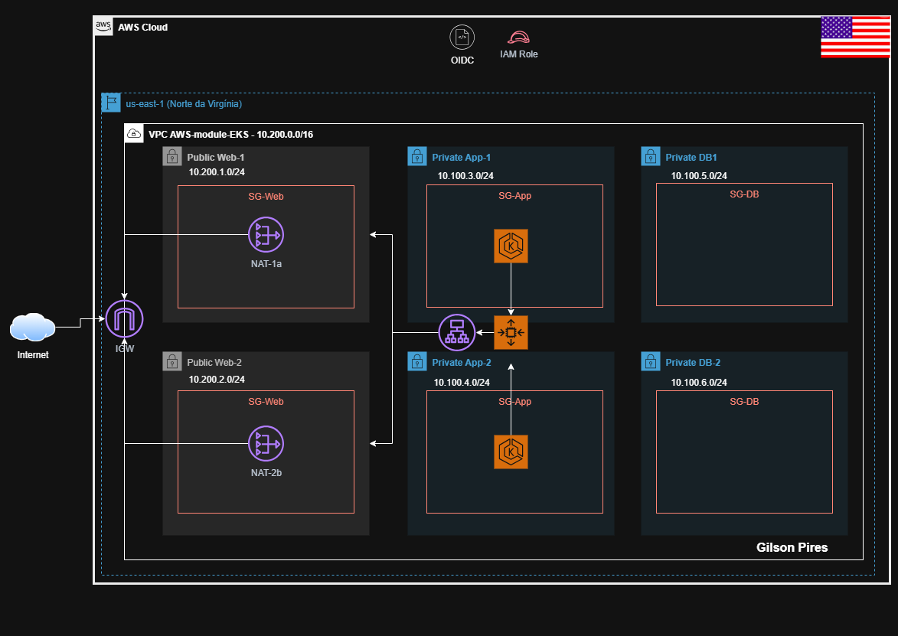

# aws-module-eks
EKS infra IAC - AWS

## Diagram

<!-- BEGIN_TF_DOCS -->
## Requirements

| Name | Version |
|------|---------|
|  [terraform](#requirement\_terraform) | 1.11.4 |
|  [aws](#requirement\_aws) | 5.97.0 |
|  [kubernetes](#requirement\_kubernetes) | 2.36.0 |

## Providers

No providers.

## Modules

| Name | Source | Version |
|------|--------|---------|
|  [eks\_cluster](#module\_eks\_cluster) | ./modules/cluster | n/a |
|  [eks\_network](#module\_eks\_network) | ./modules/network | n/a |

## Resources

No resources.

## Inputs

| Name | Description | Type | Default | Required |
|------|-------------|------|---------|:--------:|
|  [cidr\_block](#input\_cidr\_block) | Networking CIDR Block to be used for VPC | `string` | `"10.200.0.0/16"` | no |
|  [project\_name](#input\_project\_name) | Project name to be used to the name the resources | `string` | `"DevOps-EKS"` | no |

## Outputs

No outputs.
<!-- END_TF_DOCS -->